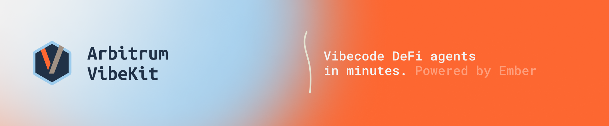
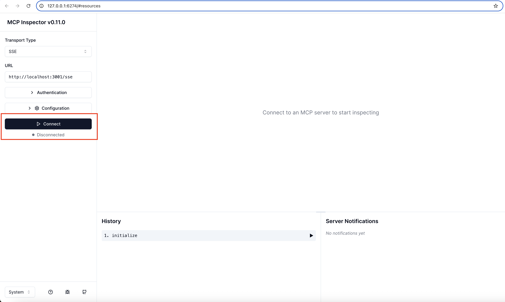
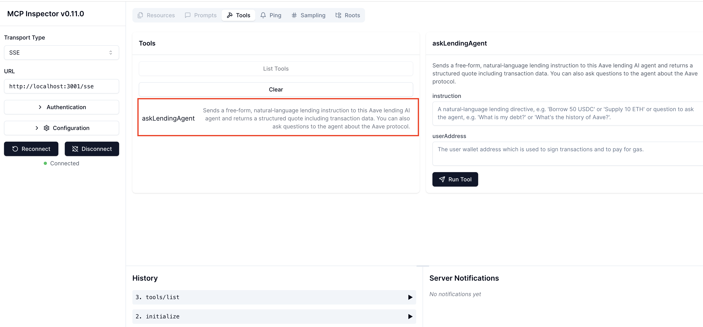
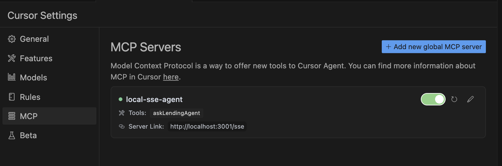

<p align="center"> 
   &nbsp&nbsp 📃 <a href="https://ember-ai.gitbook.io/arbitrum-vibekit">Documentation </a> &nbsp&nbsp | &nbsp&nbsp 🤖  <a href="https://github.com/EmberAGI/arbitrum-vibekit/tree/main/typescript/examples"> Agent Templates</a>  &nbsp&nbsp | &nbsp&nbsp 🎨  <a href="https://questbook.emberai.xyz/"> Web Interface </a> &nbsp&nbsp | &nbsp&nbsp  💬  <a href="https://discord.com/invite/bgxWQ2fSBR"> Support Discord </a>  &nbsp&nbsp | &nbsp&nbsp  📩  <a href="https://t.me/EmberChat"> Ember Telegram</a>  &nbsp&nbsp | &nbsp&nbsp  <a href="https://x.com/EmberAGI"> 𝕏 </a> &nbsp&nbsp
</p>

## 🧭 Table of Contents

- [📙 Introduction](#-introduction)
- [🧬 Repository Organization](#-repository-organization)
- [⚡ Developer Quickstart](#-developer-quickstart)
- [🎧 Vibe Coding](#-vibe-coding)
- [🎨 Web Interface](#-web-interface)
- [🔌 MCP Integration](#-mcp-integration)
- [🙌 Contribution](#-contribution)

## 📙 Introduction

Welcome to Vibekit – your polyglot toolkit for vibe coding smart, autonomous DeFi agents that vibe with the blockchain. Whether you're automating trades, managing liquidity, or integrating with on-chain and off-chain data, Vibekit makes it effortless and fun.

At its core, Vibekit leverages the Model Context Protocol (MCP), a framework that standardizes how agents interact with tools and data. Vibekit also integrates smoothly with your current agent frameworks such as Eliza and LangGraph. Just plug in our MCP tools into your existing agents and watch them level up with DeFi superpowers!

**_Development Status_**
Rapidly evolving toward a stable launch, Vibekit already provides the core toolkit you need today. Our documentation and codebase form a robust release candidate as we polish specs and features. We welcome community feedback and contributions to guide our path to a formal v1.0 release.

## 🧬 Repository Organization

Vibekit is structured as a monorepo with TypeScript at its core, with a Rust implementation is on the horizon. Here's how it's organized:

```
Vibekit/
├── typescript/
│   └── examples/
│       └── lending-agent-no-wallet/
│       └── liquidity-agent-no-wallet/
│       └── pendle-agent/
│       └── swapping-agent-no-wallet/
│       └── swapping-agent/
│----── lib/
│       └── a2a/
│       └── arbitrum-vibekit/
│       └── mcp-tools/
│           └── allora-mcp-server/
│           └── emberai-mcp/
├── CHANGELOG.md
├── CONTRIBUTIONS.md
├── LICENSE
├── README.md
```

- `examples/`: Playground for different agent templates.

- `lib/`: Core libraries and tools.

- `mcp-tools/`: Implementations of MCP tools.

## ⚡ Developer Quickstart

Ready to launch your DeFi agent?

**1. Set up your environment:**

Ensure that `Node.js` 22+ and `pnpm` are installed.

```
node -v # Should be 22+
pnpm -v # Check that pnpm is installed
```

**2. Clone the repository:**

You can do so though the command line or through your preferred IDE.

```
git clone https://github.com/EmberAGI/arbitrum-vibekit.git
cd arbitrum-vibekit
```

We recommend using the [Cursor IDE](https://www.cursor.com/). Click on the `Clone Repo` button and on the top paste the Vibekit's Github URL: https://github.com/EmberAGI/arbitrum-vibekit.git. Next, click on `Clone from Github` to setup your project.

<p align="left">
  
</p>

**3. Run your DeFi agent**

Let's run the Lending Agent. Head over to the [lending-agent-no-wallet](https://github.com/EmberAGI/arbitrum-vibekit/tree/main/typescript/examples/lending-agent-no-wallet) directory and create a `.env` file with the following required variables. Alternatively, you can create your `.env` file by copying the `.env.example` template from the agent's directory. Make sure to populate the `.env` file with the necessary configuration settings and API keys specific to your setup.

```env
OPENROUTER_API_KEY=your_openrouter_api_key
QUICKNODE_SUBDOMAIN=your_quicknode_subdomain
QUICKNODE_API_KEY=your_quicknode_api_key
OPENAI_API_KEY=your_openai_api_key

EMBER_ENDPOINT=grpc.api.emberai.xyz:50051
RPC_URL=https://arbitrum.llamarpc.com
AGENT_CACHE_TOKENS=false
PORT=3001

```

Next, navigate to the `typescript` directory and run the following `pnpm` commands to build and start your agent:

```
cd typescript &&
pnpm install &&
pnpm build &&
pnpm --filter "lending-agent-no-wallet" dev
```

Alternatively, you can use Docker to start up the agent:

```
cd typescript &&
pnpm build &&

sudo pnpm --filter "lending-agent-no-wallet" docker:compose:up
```

**4. Interact with the DeFi agent:**

Once the agent is up and running, you have two ways to engage with it:

- **Launch the Inspector interface:**

Open a new terminal window and run the following to start the inspector:

```bash
npx -y @modelcontextprotocol/inspector
```

Navigate to http://127.0.0.1:6274 in your browser to access the interface and click on "Connect" to establish a connection with your local server:

<p align="left">
  
</p>

Next, click on "List Tools" to view the tools your Lending Agent offers:

<p align="left">
  
</p>

Next, select "askLendingAgent", input your wallet address and query, and execute the tool to interact with your agent:

<p align="left">
  
</p>

The Inspector interface provides a straightforward way to interact with your agent. For a more integrated development experience, you can use the Cursor IDE.

- **Integrate with Cursor IDE**

To interact with the Lending agent though Cursor, [create or update](https://docs.cursor.com/context/model-context-protocol) your `mcp.json` file through Cursor settings with the following content. If your agent is running on a different port than 3001, make sure to adjust it:

```
{
 "mcpServers": {
   "local-sse-agent": {
     "url": "http://localhost:3001/sse"
   }
 }
}

```

You might need to restart Cursor to apply the new configuration. Upon successful integration, the MCP settings should look like this:

<p align="left">
  
</p>

Cursor will now automatically detect the Lending Agent MCP tool and you can interact with it directly through prompts.

**5. Build your own DeFi agent:**
Checkout the [examples/](https://github.com/EmberAGI/arbitrum-vibekit/tree/main/typescript/examples) directory to explore other agent templates and start building your own!

## 🎧 Vibe Coding

Vibe coding is all about teaming up with AI to streamline your development process. Instead of writing every line of code manually, you guide an AI assistant using natural language prompts. The AI understands your project's context—like folder structures, tools, and data schemas—and provides targeted suggestions to help you build more efficiently.

Vibekit enables you to build and customize DeFi agents using vibe coding. Whether you're creating a swapping agent, a lending agent, or a liquidity provider, you can describe your agent's behavior in natural language and let the AI help you implement it. The framework provides pre-built tools for common DeFi operations, MCP integration for external data, and a structured way to define your agent's capabilities through rules files.

### 🛠️ Setting Up Your IDE

To get started, we recommend using the [Cursor IDE](https://www.cursor.com/), an AI-powered development environment designed for smooth collaboration between you and your AI assistant. With Cursor, you can:

- Define your project's context using simple rule files located in the [.cursor/rules](https://docs.cursor.com/context/rules) folder.

- Run AI agents locally or remotely within your development environment.

- Integrate with [MCP-powered](https://docs.cursor.com/context/model-context-protocol) tools and workflows for enhanced functionality.

To clone Vibekit in Cursor:

1. Open Cursor and click "Clone Repository" in the welcome screen.
2. Paste the repository URL: `https://github.com/EmberAGI/arbitrum-vibekit.git`.
3. Choose your local directory and click "Clone".
4. Once cloned, Cursor will automatically detect the `.cursor/rules` folder and set up the AI context.

### 🤖 Vibe Coding Agents

Ready to vibe with some DeFi agents? to run any of the existing agents or vibe code your own, refer to [this guide](https://github.com/EmberAGI/arbitrum-vibekit/blob/main/typescript/examples/README.md).

### 🧠 Crafting Effective AI Prompts

To make the most of vibe coding, it's important to provide your AI assistant with clear and structured context. In the `.cursor/rules` folder, you can define the scope of your project, including its purpose, key components, and any relevant data schemas.

#### 📝 Vibekit's Cursor Rules Files Structure

Vibekit's rules files are located in the project's [.cursor/rules](https://github.com/EmberAGI/arbitrum-vibekit/tree/main/.cursor/rules) directory and include:

1. **createAgent.mdc**: Defines how to create and configure new agents

   - Agent initialization parameters
   - Required dependencies
   - Configuration templates
   - Best practices for agent setup

2. **scratchpad.mdc**: Serves as a workspace for testing and prototyping

   - Task descriptions
   - Code snippets
   - Quick tests and validations
   - Development notes

3. **vibeCodingWorkflow.mdc**: Outlines the development workflow
   - Step-by-step processes
   - Common patterns
   - Best practices
   - Troubleshooting guides

#### 🔄 Extending and Maintaining Rules

To add new rules or modify existing ones:

1. **Create New Rules**

- You can create a new `.mdc` file in `.cursor/rules` when:
  - Adding a new agent type
  - Creating a new tool category
  - Defining a new workflow
- Follow the structure in `createAgent.mdc` for agent rules
- Include clear documentation and examples

2. **Update Existing Rules**

- You can modify `createAgent.mdc` when:
  - Adding new agent configuration options
  - Updating initialization parameters
  - Adding new tool integrations
- You can update `scratchpad.mdc` for:
  - Testing new features
  - Prototyping new workflows
  - Validating tool integrations
- Keep `vibeCodingWorkflow.mdc` up-to-date with:
  - New development patterns
  - Updated best practices
  - Common troubleshooting solutions

## 🎨 Web Interface

You can also access the example agents through our [web-based GUI](https://questbook.emberai.xyz/) that provides a user-friendly interface for:

- Interacting with agents without local setup
- Visualizing agent responses and transactions
- Managing multiple agent interactions

To use the web-based GUI:

1. Head over to our [web interface](https://questbook.emberai.xyz/)
2. Connect your wallet (if required for the agent)
3. Select the agent you want to interact with
4. Use the chat interface to send commands
5. View transaction details and agent responses in real-time

## 🔌 MCP Integration

MCP (Model Context Protocol) makes it easy for on-chain agents to tap into external data and tools. Here's how it works: tools get registered with the MCP server, and agents can plug in to browse what's available, and start calling those tools whenever it makes sense. Agents may decide on their own when and how to use each tool, and they loop the results back into their flow, keeping everything running smoothly.
Want to dig deeper? Check out the [official MCP docs](https://modelcontextprotocol.io/introduction).

Vibekit integrates MCP in three powerful ways:

#### 🛠️ Built-in MCP Tools

Vibekit comes with a suite of ready-to-use MCP tools in the [mcp-tools](https://github.com/EmberAGI/arbitrum-vibekit/tree/main/typescript/lib/mcp-tools) directory:

- Access real-time market data and on-chain information
- Interact with DeFi protocols and smart contracts
- Execute complex trading and liquidity operations
- Bridge assets across different blockchain networks
- Each tool is designed to be plug-and-play with any MCP-compatible agent

#### 🤝 Framework Integration

Vibekit integrates with popular agent frameworks like Eliza, allowing them to:

- Access standardized tool interfaces through MCP
- Maintain their existing functionality while gaining new capabilities
- Use Vibekit's pre-built tools without modifying their core architecture

#### 🔄 Agent as MCP Server

Every agent built with Vibekit is itself an MCP server, which means:

- Agents can expose their own capabilities as MCP tools
- Other agents can discover and use these capabilities
- Agents can be both consumers and providers of MCP tools
- This creates a network of interoperable agents

You'll find our ready-to-go MCP tools and documentation in the [mcp-tools](https://github.com/EmberAGI/arbitrum-vibekit/tree/main/typescript/lib/mcp-tools) directory, great for building your own tools with minimal setup.

## 🙌 Contribution

We welcome contributions from the community! If you'd like to help improve Vibekit —whether by adding new agent templates, adding new MCP tools, or fixing bugs— please check out our [Contributing Guidelines](https://github.com/EmberAGI/arbitrum-vibekit/blob/main/CONTRIBUTIONS.md). To show our appreciation, we're launching an incentive program that will reward valuable contributions. Join us in pushing the boundaries of DeFi innovation!
