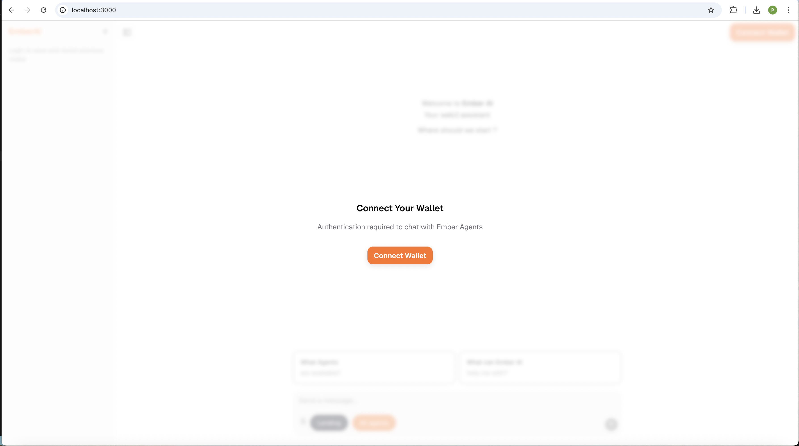
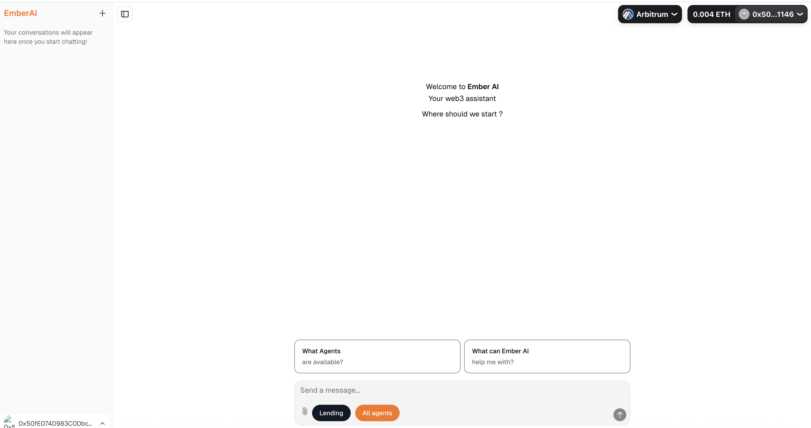

# Vibekit's Web Interface Quickstart

This guide explains how to quickly set up and run the Vibekit frontend that serves as a user interface for interacting with your AI agents. The primary way to run the frontend is locally using Docker Compose.

### Prerequisites

Make sure you have [Docker Desktop](https://www.docker.com/products/docker-desktop/) with Docker Compose v2.24 or greater installed on your system.

> [!NOTE]  
> If your are on an M-series Mac, you need to install Docker using the [dmg package](https://docs.docker.com/desktop/setup/install/mac-install/) supplied officially by Docker rather than through Homebrew or other means to avoid build issues.

### Run the Frontend

**1. Get the Code:**

How you get the code depends on whether you want to simply run the project or contribute to its development. If you just want to run Vibekit locally or explore the codebase, you can clone the repository through command line or your preferred IDE:

```
git clone https://github.com/EmberAGI/arbitrum-vibekit.git &&
cd arbitrum-vibekit
```

If you plan to contribute changes to Vibekit, fork the repository on [Vibekit's Github page](https://github.com/EmberAGI/arbitrum-vibekit) and clone your fork locally. Replace `YOUR_USERNAME` with your GitHub username:

```
git clone https://github.com/YOUR_USERNAME/arbitrum-vibekit.git &&
cd arbitrum-vibekit
```

For more detailed contribution steps, please see our [Contribution Guidelines](CONTRIBUTIONS.md).

**2. Configure Environment Variables:**

Navigate to the [typescript](https://github.com/EmberAGI/arbitrum-vibekit/tree/main/typescript) directory and create a `.env` file by copying the example template:

```bash
cd typescript &&
cp .env.example .env
```

Open the `.env` file and fill in the required values. This typically includes:

- Your preferred LLM provider API key (e.g., `OPENROUTER_API_KEY`).
- Generate a secure `AUTH_SECRET` (you can use https://generate-secret.vercel.app/32 or `openssl rand -base64 32`).
- Set a `POSTGRES_PASSWORD`.

**3. Start Services with Docker Compose:**

From the [typescript](https://github.com/EmberAGI/arbitrum-vibekit/tree/main/typescript) directory, run the following command to build and start the frontend and its associated services (including the lending agent, the swapping agent and the database):

```bash
# Ensure you are in the typescript/ directory
docker compose up
```

> [!NOTE]  
> If you get a `permission denied error`, try running the above command with `sudo`:
>
> ```bash
> sudo docker compose up
> ```

> [!WARNING]
> If you previously ran `docker compose up` with an older version of this repository and encounter frontend errors or database-related errors in the `docker service logs`, follow these steps:
>
> 1. Clear your browser cache.
> 2. Run the following command in your terminal:
>    ```bash
>    docker compose down && docker volume rm typescript_db_data && docker compose build web --no-cache && docker compose up
>    ```

**4. Access Vibekit's Web Interface:**

Open your web browser and navigate to http://localhost:3000. To be able to chat with the agents, you need to connect your wallet first. Click on "Connect Wallet" to get started:

<p align="left">
  
</p>

After setting up your wallet, you can interact with the lending and swapping agents through the chat interface:

<p align="left">
  
</p>

### Integrating a Custom Agent

To integrate another example agent or a custom agent into the frontend, refer to [this guide](https://github.com/EmberAGI/arbitrum-vibekit/blob/main/typescript/clients/web/README.md#agent-configuration).
