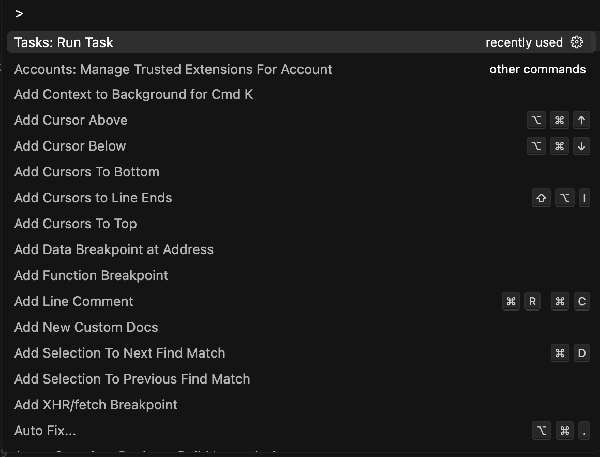
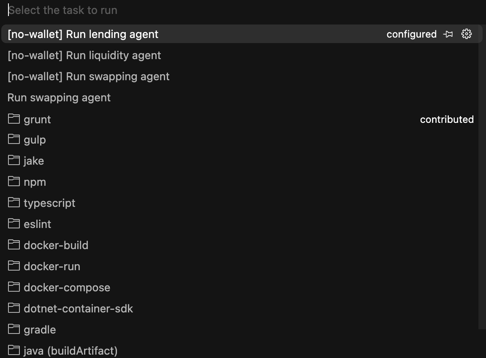

## 🎛️ Agent Playground

> [!IMPORTANT]  
> The [`examples`] directory is being deprecated in favor of v2 [templates](../templates/). The examples directory contains the older architecture and will be removed in future releases.

This directory contains ready-to-roll DeFi agents built with the Vibekit. These agents showcase how to deploy smart, autonomous on-chain agents in a few steps. Each agent also doubles as an MCP tool, which enables powerful agent-to-agent integrations.

Many of the tools and operations these agents use are defined in [`mcp-tools`](https://github.com/EmberAGI/arbitrum-vibekit/tree/main/typescript/lib/mcp-tools). If you're building a new agent or want to extend functionality, the `mcp-tools` directory is the place to define your tool logic and add new capabilities for your agents to use.

Follow this guide to

- [Run existing Vibekit agents](#-run-existing-agents)
- [Build your own custom agents](#%EF%B8%8F-build-your-own-agent)

## 🚀 Run Existing Agents

### 1. Set Up Your IDE

To get started, we recommend installing [Cursor IDE](https://www.cursor.com/). Cursor offers an AI-powered development environment that is designed for smooth collaboration between you and your AI assistant.

With Cursor, you can:

- Define your project's context using simple [rule files](https://docs.cursor.com/context/rules) located in `.cursor/rules `folder.

- Run Vibekit's AI agents locally or remotely within your development environment.

- Integrate [MCP-powered](https://docs.cursor.com/context/model-context-protocol) tools and workflows.

To clone Vibekit in Cursor:

1. Open Cursor and click "Clone repo" in the welcome screen.
2. Paste the repository URL: https://github.com/EmberAGI/arbitrum-vibekit.git.
3. Choose your local directory and click "Clone".

<p align="left">
  
</p>

Once cloned, Cursor will automatically detect Vibekit's [`.cursor/rules`](https://github.com/EmberAGI/arbitrum-vibekit/tree/main/.cursor/rules) directory and set up the AI context.

### 2. Set Up Your Environment

First, ensure that [`Node.js 22+`](https://nodejs.org/) and [`pnpm`](https://pnpm.io/) are installed on your system.

```bash
node -v # Should be 22+
pnpm -v # Check that pnpm is installed
```

Next, navigate to the desired agent's directory and create an `.env` file. Copy the contents of `.env.example` into the `.env` file and fill in any required secrets or configuration variables.

### 3. Install Packages

Navigate to the [`typescript`](https://github.com/EmberAGI/arbitrum-vibekit/tree/main/typescript) directory and install the necessary packages.

```bash
cd typescript && pnpm install
```

### 4. Start Agent

You can start an agent in four different ways. Simply choose the approach that best fits your preferences and project setup:

**1. Cursor's AI Assistant (Vibe Coding)**:

Ask Cursor's integrated AI assistant to run your desired agent. Make sure to add the desired agent's directory to Cursor's chat context.

**2. Agent as Task**:

If you are using VSCode or Cursor, you can run agents as [tasks](https://github.com/EmberAGI/arbitrum-vibekit/blob/main/.vscode/tasks.json). To start an agent:

- Open the Vibekit repo in your preferred IDE.
- Press on `Cntrl + shift + P` ( `Cmnd + shift + P` on Mac) to open up the Command Palette.
- Search for "Run Task".

<p align="left">
  
</p>

- Choose you're desired agent to run.

<p align="left">
  
</p>

The agent will be available locally on the port specified in the Dockerfile within the agent's folder.

> [!NOTE]  
> If you are running multiple agents simultaneously, make sure their ports do not conflict. You can verify and adjust the port settings by referring to the Dockerfile in each agent's directory.

**3. Docker Compose**:

To use this option, make sure you have [Docker Desktop](https://www.docker.com/products/docker-desktop/) with Docker Compose `v2.24` or greater installed on your system. Run the MCP-enabled Docker container in the [`typescript`](https://github.com/EmberAGI/arbitrum-vibekit/tree/main/typescript) directory to start your agent. Replace the `"agent-name"` with the name of your desired agent, for example: `"swapping-agent-no-wallet"`.

```bash
pnpm --filter "agent-name" docker:compose:up
```

> [!NOTE]  
> If you get a `permission denied error`, try running the above command with `sudo`:
>
> ```bash
> sudo pnpm --filter "agent-name" docker:compose:up
> ```

> [!TIP]  
>  To run the agent in the background so you can keep using your terminal, use the `-d` flag:
>
> ```bash
> pnpm --filter "agent-name" docker:compose:up -d
> ```

To stop the agent afterwards, use the following command:

```bash
pnpm --filter "agent-name" docker:compose:down
```

**4. Local Development**:

Run the following `pnpm` commands in the [`typescript`](https://github.com/EmberAGI/arbitrum-vibekit/tree/main/typescript) directory to build and run your agent. Replace the `"agent-name"` with the name of your desired agent, for example: `"swapping-agent-no-wallet"`.

```bash
pnpm build && pnpm --filter "agent-name" dev
```

### 5. Interact with Agent

Once the agent is up and running, you have two ways of interacting with it:

**1. Vibekit's Web Interface**

To interact with the agent through the web interface, refer to [this quickstart](https://github.com/EmberAGI/arbitrum-vibekit/blob/main/typescript/clients/web/README.md#quickstart).

**2. Integrate with Cursor IDE**

> [!TIP]  
> This configuration approach is also compatible with other graphical MCP clients like [Claude Desktop](https://modelcontextprotocol.io/quickstart/user) and [Windsurf](https://docs.windsurf.com/windsurf/mcp). Simply adjust the settings accordingly in their respective configuration files.

To interact with the agent through Cursor, [create or update](https://docs.cursor.com/context/model-context-protocol) your `mcp.json` file through Cursor's MCP settings with the following content. If your agent is running on a different port than 3001, make sure to adjust it:

```json
{
  "mcpServers": {
    "local-sse-agent": {
      "url": "http://localhost:3001/sse"
    }
  }
}
```

You might need to restart Cursor to apply the new configuration. Upon successful integration, Cursor will automatically detect the Agent MCP tool and you can interact with it directly through prompts.

## 🛠️ Build Your Own Agent

To get started with building your own agent, we recommend checking out our [`quickstart-agent`](https://github.com/EmberAGI/arbitrum-vibekit/tree/main/typescript/templates/quickstart-agent). It's a comprehensive template that demonstrates all the core features of the v2 Vibekit framework. It serves as an excellent starting point and a developer template.
