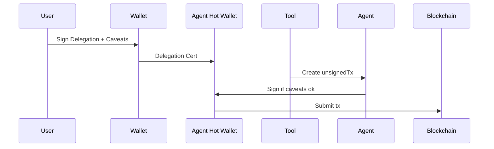

# **Lesson 18: Agent Validation and Transaction Security**

---

### 🔍 Overview

Some agents are responsible for proposing or submitting blockchain transactions on behalf of the user. These actions carry financial risk. To ensure security, transparency, and user control, agents must validate transactions and respect explicit user intent.

This lesson explains how to intercept, inspect, and control signing flows—without exposing raw private keys or acting without approval.

---

### 🛡️ Use Delegated Signing or Delegations

There are **two safe patterns** for transaction authorization:

1. **Unsigned‑tx + user wallet** – The agent returns a raw transaction, and the user signs in their own wallet.
2. **Delegation Toolkit** – The user signs a _delegation_ granting the agent’s **hot wallet** limited rights. The agent then signs transactions **on behalf of** the user, but only within the delegation’s caveats (token limit, expiry, whitelisted contracts).

With the second pattern your agent process typically:



**Key points**

- The **agent hot wallet key** lives in `AGENT_WALLET_PK` env var.
- Delegations are verified in a `before()` hook using the MetaMask Delegation Toolkit helpers (`verifyDelegation(caveats)`).
- If caveats block the action, throw `AgentError('CaveatFail',…)`.

---

### 🔁 Enforce Fee Logic on Unsigned Flows

Some tools (like token swaps) return unsigned tx data **after** performing logic. But you don’t want to re-run that logic after payment.

Solution:

- Run the tool once to generate the transaction
- Store the result in task state (e.g. `ctx.setTaskState({ unsignedTx })`)
- Require x402 payment **before** returning the stored tx

This ensures:

- No duplicate execution
- The user pays _after_ approval, but _before_ transaction return
- You can calculate a flat or % fee based on the transaction value

---

### 🔍 Validate Transaction Intent

Even with delegated signing, agents can:

- Enforce spending limits
- Confirm `to`, `value`, and calldata match intent
- Log or audit transactions for off-chain review

You can use hooks to insert transaction validation logic:

```ts
export const after = (ctx) => {
  if (!ctx.result?.unsignedTx?.to.includes("uniswap")) {
    throw new AgentError("InvalidTx", "Recipient not whitelisted");
  }
};
```

---

### 🔐 What Not to Do

- Don’t ever hardcode or ship private keys
- Don’t return signed transactions without explicit user approval
- Don’t re-run sensitive logic after payment or signing

---

### ✅ Summary

Transaction-generating tools must protect users by requiring payment _before release_, signing _outside the agent_, and intent validation throughout.

> "Your agent can help execute. But only the user should commit."

| Decision                                  | Rationale                                                                                                       |
| ----------------------------------------- | --------------------------------------------------------------------------------------------------------------- |
| **Unsigned-tx pattern**                   | Guarantees user remains final signer; agent cannot broadcast unauthorized transfers.                            |
| **Delegation Toolkit path**               | Gives power users an option to pre-authorize limited actions, improving UX for repetitive transactions.         |
| **Store unsignedTx in task state**        | Ensures heavy price-quote or swap logic runs once, fee is charged, then tx is delivered—no duplicate execution. |
| **Payment before release**                | Aligns with x402 flow; prevents user from getting valuable data (tx blob) without paying the tool fee.          |
| **Validation of `to`, `value`, calldata** | Demonstrates how to assert intent after tx generation but before signing—avoids phishing or mis-routing.        |
