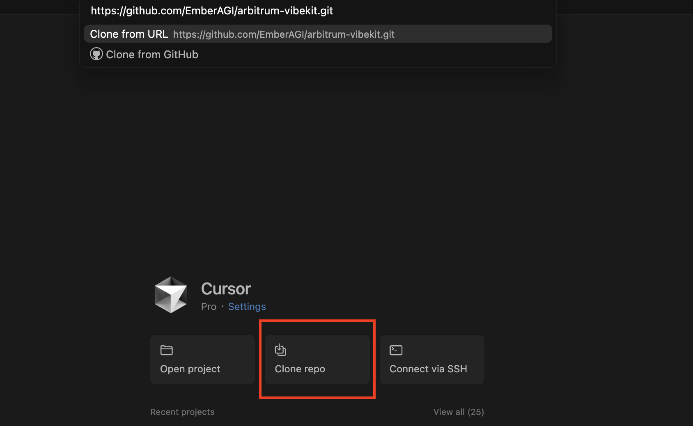

## 🧩 MCP Tools

Welcome to Vibekit's MCP tools directory! Model Context Protocol (MCP) tools are standardized interfaces that allow agents to easily interact with on-chain data, execute DeFi operations, and integrate with external services. This directory contains the MCP building blocks that give DeFi agents their superpowers.

## 🛠️ Building Your MCP Tool

By contributing new MCP tools, you're expanding the possibilities for all Vibekit agents. Your tools can enable new DeFi strategies, integrate additional protocols, or enhance existing capabilities. This guide will walk you through the process of creating and contributing your own MCP tools to the ecosystem. Before submitting a pull request for your work, please review the guidelines in [`CONTRIBUTIONS.md`](https://github.com/EmberAGI/arbitrum-vibekit/blob/main/CONTRIBUTIONS.md) to ensure best practices are followed.

### 1. Set Up Your IDE

To get started, we recommend installing [Cursor IDE](https://www.cursor.com/). Cursor offers an AI-powered development environment that is designed for smooth collaboration between you and your AI assistant.

With Cursor, you can:

- Define your project's context using simple [rule files](https://docs.cursor.com/context/rules) located in `.cursor/rules `folder.

- Run Vibekit's AI agents locally or remotely within your development environment.

- Integrate [MCP-powered](https://docs.cursor.com/context/model-context-protocol) tools and workflows.

To clone Vibekit in Cursor:

1. Open Cursor and click "Clone repo" in the welcome screen.
2. Paste the repository URL: https://github.com/EmberAGI/arbitrum-vibekit.git.
3. Choose your local directory and click "Clone".

<p align="left">
  
</p>

Once cloned, Cursor will automatically detect Vibekit's [`.cursor/rules`](https://github.com/EmberAGI/arbitrum-vibekit/tree/main/.cursor/rules) directory and set up the AI context.

### Using Claude Code CLI

If you prefer using Claude Code instead, you can install the Claude Code CLI and interact with Vibekit entirely from your terminal:

```bash
npm install -g @anthropic-ai/claude-code &&
cd arbitrum-vibekit
```

Next you can can start planning and executing with Claude:

```bash
claude plan "Create a new MCP tool that fetches on-chain NFT metadata" &&
claude execute
```

Because the `.claude/` folder is part of this repository, the CLI automatically applies all prompts and hooks, ensuring a consistent developer experience.

To learn more about Claude Code, visit [their official docs](https://docs.anthropic.com/en/docs/claude-code/overview).

### 2. Set Up Your Project

If you'd like to speed up the setup process, consider using [FastMCP](https://github.com/punkpeye/fastmcp/) or [AI Tool Maker](https://github.com/nihaocami/ai-tool-maker). These tools can automatically generate the boilerplate code and folder structure for your MCP tool, allowing you to focus on your tool's unique logic. If you prefer a more hands-on approach or need a custom setup, follow the manual steps outlined below to build your MCP tool from scratch.

1.  **Create a Project Directory**:

    Inside the [`mcp-tools`](https://github.com/EmberAGI/arbitrum-vibekit/tree/main/typescript/lib/mcp-tools) directory, create a new directory for your project.

2.  **Set Up the File Structure**:

    Create a `src` folder with an `index.ts` file inside. This will be the main entry point for your tool server. You can reference existing MCP tool implementations in this directory for guidance on structure and patterns.

3.  **Define Configuration**:

    Create a `.env.example` file to list the environment variables your tool needs. Users will copy this to a `.env` file and provide their own values.

4.  **Add Project Metadata**:

    Create a `package.json` file to manage your project's dependencies and scripts.

    Optionally, add a `tsconfig.json` for TypeScript compiler settings.

5.  **Install Dependencies**:

    Once your `package.json` is set up, run `pnpm install` to install dependencies. This command depends on the package manager defined in your `package.json` file.

    **pnpm** (recommended)

    ```bash
    pnpm install
    ```

### 3. Define Your Tools

In your `src/index.ts` file, use Zod to define the schemas for your tool's parameters. A schema specifies the expected data types, applies validation rules, and includes descriptions that an AI can use to understand how to use the tool.

```typescript
import { z } from 'zod';

// Define the schema for a tool that performs a simple operation
const myOperationSchema = {
  paramOne: z.string().describe('A descriptive name for the first parameter.'),
  paramTwo: z.number().describe('A descriptive name for the second parameter.'),
};

// Create a Zod object from the schema to infer the parameter types
const myOperationParams = z.object(myOperationSchema);
type MyOperationParams = z.infer<typeof myOperationParams>;
```

### 4. Initialize the MCP Server

With your schemas defined, set up the MCP server to host your tool and handle incoming requests. When initializing the server, provide a unique name and a version number.

```typescript
import { McpServer } from '@modelcontextprotocol/sdk/server/mcp.js';
import { StdioServerTransport } from '@modelcontextprotocol/sdk/server/stdio.js';

const server = new McpServer({
  name: 'my-mcp-tool-server',
  version: '1.0.0',
});

// If your tool needs to interact with an external API, initialize the corresponding
// SDK client here. For example:
// const myClient = new MySdkClient(process.env.MY_ENDPOINT || 'default-endpoint');
```

### 5. Register Your Tools

Register each tool with the `McpServer` instance by calling the `server.tool()` method. This method requires a name, a description, the parameter schema you defined, and a callback function that contains the tool's execution logic.

```typescript
server.tool(
  'myOperation',
  'A clear, concise description of what the operation does.',
  myOperationSchema,
  async (params: MyOperationParams) => {
    try {
      // In this example, we'll just log the parameters. This is where you would add your tool's logic, such as
      // calling an external API.
      console.log(`Received parameters: ${JSON.stringify(params, null, 2)}`);

      return {
        content: [{ type: 'text', text: `Operation successful.` }],
      };
    } catch (error) {
      return {
        isError: true,
        content: [{ type: 'text', text: `Error: ${(error as Error).message}` }],
      };
    }
  }
);
```

### 6. Advanced Tool Customization with Hooks

For advanced use cases, you can enhance your MCP tools with hooks that run before or after tool execution. This pattern, similar to [Anthropic's hooks concept for Claude Code](https://docs.anthropic.com/en/docs/claude-code/hooks), allows you to:

- Add logging and monitoring
- Validate inputs beyond schema validation
- Transform outputs or add metadata
- Implement caching or rate limiting
- Add authentication or authorization layers

Vibekit provides a `withHooks` utility that wraps your tools with before/after functionality:

```typescript
import { withHooks } from 'arbitrum-vibekit-core';

const enhancedTool = withHooks(myBaseTool, {
  before: async (args, context) => {
    console.log('Tool called with:', args);
    return args; // or transform them
  },
  after: async (result, context) => {
    console.log('Tool result:', result);
    return result; // or transform it
  },
});
```

For detailed patterns and best practices, see our [hooks documentation](https://github.com/EmberAGI/arbitrum-vibekit/blob/main/typescript/lib/arbitrum-vibekit-core/docs/lesson-16.md) and refer to [Anthropic's hooks guide](https://docs.anthropic.com/en/docs/claude-code/hooks) for additional customization patterns.

### 7. Run Your MCP Server

To allow your MCP tool to communicate with an agent, connect your server to a transport layer, such as STDIO, and create an entry point for execution. The following `main` function includes graceful shutdown handling to ensure that the server closes cleanly when it receives a termination signal.

```typescript
async function main() {
  const transport = new StdioServerTransport();
  try {
    await server.connect(transport);
    console.error('MCP server started and connected.');

    const cleanup = async () => {
      console.error('Shutting down MCP server...');
      try {
        await server.close();
        console.error('Server closed successfully.');
        process.exit(0);
      } catch (err) {
        console.error('Error during server cleanup:', err);
        process.exit(1);
      }
    };

    process.on('SIGINT', cleanup);
    process.on('SIGTERM', cleanup);
  } catch (error) {
    console.error('Failed to start server:', error);
    process.exit(1);
  }
}

main();
```

### 8. Inspect Your MCP Tool

You can quickly test your MCP tool using the Inspector, which provides an interactive interface for sending requests and viewing responses. Before running the Inspector, add a `build` script to your `package.json` file to compile your TypeScript code.

```json
"scripts": {
  "build": "tsc"
}
```

Then, build your project and launch the Inspector with the following command:

```bash
pnpm run build && npx -y @modelcontextprotocol/inspector node ./dist/index.js
```

### 9. Showcase Your Tool with a Demo Agent

Consider showcasing your new MCP tool by building a demo agent in the [templates](https://github.com/EmberAGI/arbitrum-vibekit/tree/main/typescript/templates) directory. Creating a simple agent that uses your tool is a great way to demonstrate its functionality and help others understand how to integrate it into their own projects.
