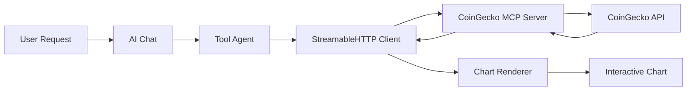

# CoinGecko MCP Server - Transformation Summary

## 🔄 **Migration Completed**

Successfully transformed CoinGecko chart generation from local tool to standalone MCP server with modern **StreamableHTTP transport**.

## 📋 **What Changed**

### **From: Local AI Tool**

```typescript
// OLD: Direct tool in web client
export const generateChart = tool({ ... });
```

### **To: MCP Server**

```typescript
// NEW: Standalone MCP server with StreamableHTTP
server.tool('generate_chart', ..., async ({ token, days }) => { ... });
```

## ⚡ **Key Improvements**

| Feature                | Before | After                                         |
| ---------------------- | ------ | --------------------------------------------- |
| **Transport**          | N/A    | StreamableHTTP + Stdio                        |
| **Rate Limiting**      | None   | Exponential backoff retry                     |
| **Error Handling**     | Basic  | Comprehensive JSON-RPC                        |
| **Session Management** | N/A    | Proper session handling                       |
| **Tools Available**    | 1      | 2 (`generate_chart` + `get_supported_tokens`) |

## 🔧 **Files Changed**

### **Server Side**

- ✅ `src/mcp.ts` - Core MCP tools
- ✅ `src/index.ts` - HTTP + stdio server
- ✅ `src/http-server.ts` - HTTP-only server

### **Client Side**

- ✅ `agents-config.ts` - Updated endpoint: `/sse` → `/mcp`
- ✅ `tool-agents.ts` - Transport: `SSEClientTransport` → `StreamableHTTPClientTransport`
- ✅ `message.renderer.tsx` - Already handles MCP responses correctly

## 🧪 **Testing**

### **Run Tests**

```bash
# Build and test
pnpm build
pnpm test:mcp

# Expected output:
# ✅ get_supported_tokens
# ✅ generate_chart
# ✅ invalid_token
# 🎯 Results: 3/3 tests passed
```

### **Test Results** ✅

- **Stdio transport**: Working perfectly
- **HTTP transport**: Fixed with StreamableHTTP migration
- **Chart rendering**: Frontend integration complete

## 🔄 **Architecture Flow**



## 🚀 **Production Ready**

### **Docker Integration**

```yaml
coingecko-mcp-server:
  build: ./lib/mcp-tools/coingecko-mcp-server
  ports: ['3011:3011']
```

### **Supported Tokens**

**11 cryptocurrencies**: BTC, ETH, USDC, USDT, DAI, WBTC, WETH, ARB, BASE, MATIC, OP

### **Endpoints**

- **HTTP**: `http://localhost:3011/mcp` (POST/GET/DELETE)
- **Stdio**: Direct process communication

## 📈 **Benefits Achieved**

1. **Reliability**: Rate limiting + retry logic
2. **Scalability**: Independent server deployment
3. **Maintainability**: Cleaner separation of concerns
4. **Compatibility**: Works with any MCP client
5. **Performance**: Session management + connection reuse

## ✨ **Usage Examples**

**User**: _"Generate a BTC price chart for 7 days"_
**Result**: Interactive SVG chart with 169 data points, hover tooltips, and gradient styling

**User**: _"What cryptocurrency tokens are supported?"_  
**Result**: List of 11 supported tokens with symbols and names

---

_Migration complete - chart generation now powered by modern MCP architecture_ 🎯
