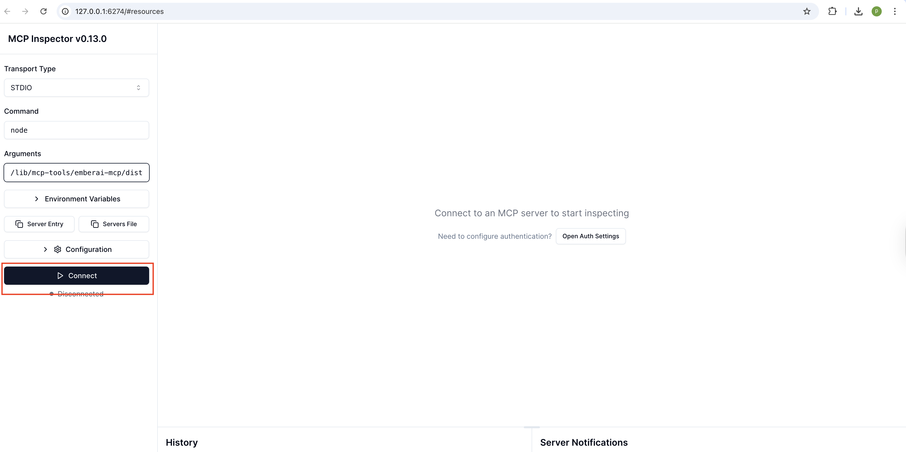
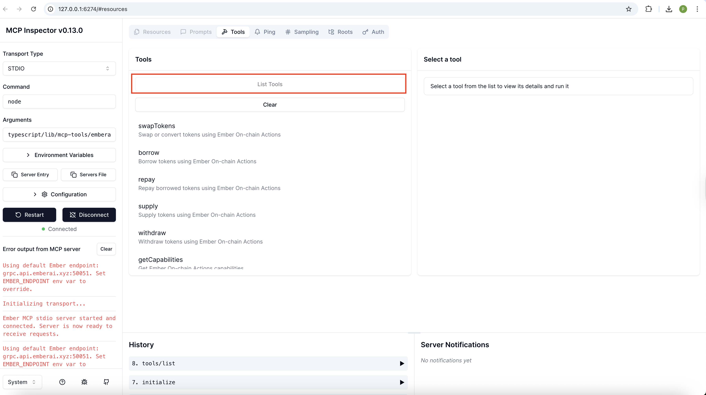

## EmberAI MCP Server

Ember is a powerful MCP (Model Context Protocol) server that acts as a one-stop solution for managing and executing complex DeFi operations across multiple chains. By providing simple, well-documented interfaces, Ember empowers AI agents to dynamically select, compose, and interact with DeFi protocols without the need for custom implementations.

Ember's declarative DeFi layer enables AI agents to interpret and execute user intents while offering developers a unified interface to the entire DeFi ecosystem. With access to rich market data, developers can leverage Ember to create custom DeFi strategies and effortlessly automate advanced workflows.

## Prerequisites

**1. Node.js ≥22**

**2. pnpm**

**3. TypeScript** (configured in the `tsconfig.json` file)

## Quickstart

1. Clone the Vibekit repository and navigate to the `emberai-mcp` folder.

   ```bash
   git clone https://github.com/EmberAGI/arbitrum-vibekit.git &&
   cd arbitrum-vibekit/typescript/lib/mcp-tools/emberai-mcp

   ```

2. Install dependencies and build the project:

   ```bash
   pnpm install &&
   pnpm build
   ```

3. Start the MCP server:

   ```bash
   pnpm start
   ```

Clients can now connect via STDIO transport to invoke the MCP tools. For instance, you can use the Inspector to interact with Ember's MCP tools. In a new terminal, run the following to launch the inspector:

```bash
npx -y @modelcontextprotocol/inspector
```

Navigate to http://127.0.0.1:6274 in your browser to access the interface and click on "Connect" to establish a connection with your local server:

<p align="left">
  
</p>

Next, click on "List Tools" to get a list of Ember's MCP tools:

<p align="left">
  
</p>

Next, simply click on the desired tool to start interacting with it.

## Available Tools

Below is a comprehensive list of MCP tools offered by Ember. For more details on Ember's capabilities, visit the [official documentation page](https://docs.emberai.xyz/).

<details>
<summary>1. swapTokens</summary>

Facilitates the exchange of one cryptocurrency for another across various decentralized exchanges (DEXs).

**Parameters:**

- fromTokenAddress (string): The contract address of the token to swap from.
- fromTokenChainId (string): The chain ID where the fromToken contract resides.
- toTokenAddress (string): The contract address of the token to swap to.
- toTokenChainId (string): The chain ID where the toToken contract resides.
- amount (string): The amount of the fromToken to swap (atomic, non-human readable format).
- userAddress (string): The wallet address initiating the swap.

**Return Value:**

An array of transaction objects representing the swap operation.​

</details>
<br>
<details>
<summary>2. borrow</summary>

Enables users to take out loans from various DeFi lending protocols by supplying collateral.

**Parameters:**

- tokenAddress (string): The contract address of the token to borrow.
- tokenChainId (string): The chain ID where the token contract resides.
- amount (string): The amount to borrow (human readable format expected by SDK).
- userAddress (string): The wallet address initiating the borrow.

**Return Value:**

An array of transaction objects representing the borrow operation.​

</details>
<br>
<details>
<summary>3. repay</summary>

Allows users to pay back outstanding loans on DeFi lending protocols.

**Parameters:**

- tokenAddress (string): The contract address of the token to repay.
- tokenChainId (string): The chain ID where the token contract resides.
- amount (string): The amount to repay (human-readable format).
- userAddress (string): The wallet address initiating the repayment.

**Return Value:**

An array of transaction objects representing the repayment operation.​

</details>
<br>
<details>
<summary>4. supply</summary>

Enables users to deposit assets into DeFi lending protocols to earn interest or to serve as collateral for borrowing.

**Parameters:**

- tokenAddress (string): The contract address of the token to supply.
- tokenChainId (string): The chain ID where the token contract resides.
- amount (string): The amount to supply (human readable format).
- userAddress (string): The supplier's wallet address.

**Return Value:**

An array of transaction objects representing the supply operation.​

</details>
<br>
<details>
<summary>5. withdraw</summary>

Allows users to retrieve assets they have previously deposited into DeFi lending protocols, including any accrued interest or unlocking collateral.

**Parameters:**

- tokenAddress (string): The contract address of the token to withdraw.
- tokenChainId (string): The chain ID where the token contract resides.
- amount (string): The amount to withdraw (human readable format).
- userAddress (string): The lender's wallet address.

**Return Value:**

An array of transaction objects representing the withdrawal operation.​

</details>
<br>
<details>
<summary>6. getCapabilities</summary>

Retrieves a detailed list of functionalities and services supported by the Ember MCP server. This can include supported chains, protocols, and specific actions the server can perform.

**Parameters:**

- type (enum of CapabilityType): The type of capabilities to get.

**Return Value:**

An object detailing the capabilities supported by Ember's MCP server.​

</details>
<br>
<details>
<summary>7. getUserPositions</summary>

Fetches a comprehensive overview of a user's holdings and investments across various DeFi protocols and assets, including token balances, supplied/borrowed amounts, and liquidity pool shares.

**Parameters:**

- userAddress (string): The wallet address to fetch positions for.

**Return Value:**

An object containing the user's wallet positions across various tokens and protocols.​

</details>
<br>
<details>
<summary>8. getTokens</summary>

Retrieves a list of tradable tokens supported by Ember, with options to filter by chain ID or other criteria.

**Parameters:**

- chainId (string, optional): The chain ID to get tokens for.
- filter (string, optional): A filter to apply to the tokens.

**Return Value:**

An array of token objects matching the specified criteria.

</details>
<br>
<details>
<summary>9. supplyLiquidity</summary>

Enables users to deposit a pair of tokens into a liquidity pool on a decentralized exchange (DEX), facilitating trading and earning fees.

**Parameters:**

- token0Address (string): The contract address of the first token in the pair (token0).
- token0ChainId (string): The chain ID where the token0 contract resides.
- token1Address (string): The contract address of the second token in the pair (token1).
- token1ChainId (string): The chain ID where the token1 contract resides.
- amount0 (string): The amount of token0 to supply (human-readable format).
- amount1 (string): The amount of token1 to supply (human-readable format).
- priceFrom (string): The lower bound price for the liquidity range (human-readable format).
- priceTo (string): The upper bound price for the liquidity range (human-readable format).
- userAddress (string): The wallet address supplying the liquidity.

**Return Value:**

An array of transaction objects representing the supply operation.

</details>
<br>
<details>
<summary>10. withdrawLiquidity</summary>

Allows users to remove their supplied tokens from a liquidity pool on a DEX, retrieving their share of the pool's assets and any accrued fees.

**Parameters:**

- tokenId (string): The NFT token ID representing the liquidity position to withdraw.
- providerId (string): The ID of the liquidity provider protocol (e.g., 'uniswap_v3'). Usually obtained from the getUserLiquidityPositions tool.
- userAddress (string): The wallet address withdrawing the liquidity.

**Return Value:**

An array of transaction objects representing the withdrawal operation.

</details>
<br>
<details>
<summary>11. getLiquidityPools</summary>

Retrieves information about available liquidity pools across various DEXs, including details on token pairs, current liquidity, and fee structures.

**Parameters:**

- This tool does not require any parameters.

**Return Value:**

An object containing the available liquidity pools.

</details>
<br>
<details>
<summary>12. getUserLiquidityPositions</summary>

Fetches details of a user's specific investments in liquidity pools, including the amount of tokens supplied, the share of the pool, and unrealized gains or losses.

**Parameters:**

- userAddress (string): The wallet address to fetch liquidity positions for.

**Return Value:**

An object containing the user's liquidity positions.

</details>
<br>
<details>
<summary>13. getYieldMarkets</summary>

Retrieves information about available yield-generating opportunities across various DeFi protocols. This can include details on staking, lending, and liquidity mining, along with their potential returns and associated risks.

**Parameters:**

- This tool does not require any parameters.

**Return Value:**

An object containing yield market information.

</details>
<br>
<details>
<summary>14. getWalletBalances</summary>

Retrieves token balances for a specific wallet address.

**Parameters:**

- walletAddress (string): The wallet address to fetch token balances for.

**Return Value:**

An object containing the wallet's token balances.

</details>
<br>
<details>
<summary>15. getMarketData</summary>

Retrieves live market data for a specific token.

**Parameters:**

- tokenAddress (string): The contract address of the token to get market data for.
- tokenChainId (string): The chain ID where the token contract resides.

**Return Value:**

An object containing the market data for the token.
</details>

## Chains and Protocols

### 1. Lending and Borrowing

One of Ember's core capabilities is supporting lending and borrowing protocols across multiple chains. This allows users to interact with DeFi markets in a variety of ways, such as:

- Supply tokens to earn yield
- Use supplied tokens as collateral
- Borrow tokens against their collateral
- Repay borrowed positions
- Withdraw previously supplied tokens

<details>
<summary> Supported Chains </summary>

- Arbitrum (`42161`)
- Base (`8453`)
- Optimism (`10`)
- Polygon (`137`)
- Ethereum Mainnet (`1`)
</details>

### 2. Token Swaps

Ember makes it easy to swap tokens across supported protocols and chains. This allows users to trade digital assets with flexibility and perform actions such as:

- Exchanging tokens directly on a single network
- Swapping tokens between different chains
- Choosing from over 7,785 tradeable assets for their swaps

<details>
<summary>Supported Chains</summary>

Ember supports swaps across 200+ chains, including:

#### Major EVM Networks

1. Ethereum Mainnet (`1`)
2. Arbitrum (`42161`)
3. Base (`8453`)
4. Optimism (`10`)
5. Polygon (`137`)
6. BSC (`56`)
7. Avalanche (`43114`)
8. Fantom (`250`)
9. Linea (`59144`)
10. Manta (`169`)
11. Mantle (`5000`)
12. Scroll (`534352`)
13. ZkSync Era (`324`)
14. Polygon zkEVM (`1101`)

#### Non-EVM Networks

1. Solana (`1399811149`)
2. Sui (`1002`)
3. Tron (`728126428`)

#### Cosmos Ecosystem

1. Cosmos (`1003`)
2. Osmosis (`1001`)
3. Injective (`1004`)
4. Kava (`1005`)
5. ThorChain (`1006`)
6. Sei (`713`)

#### Other Networks

1. Moonbeam (`1284`)
2. Moonriver (`1285`)
3. Neon (`245022934`)
4. ZetaChain (`7000`)
5. Zilliqa (`32769`)
6. Klaytn (`8217`)

</details>

### 3. Liquidity Provision & Management

Ember facilitates participation in decentralized exchange (DEX) liquidity pools, a cornerstone of automated market makers (AMMs). This enables users to contribute assets to these pools, earn transaction fees, and manage their investments with actions such as:

- Supplying assets to liquidity pools
- Withdrawing assets from liquidity pools
- Discovering available liquidity pools
- Tracking liquidity positions
