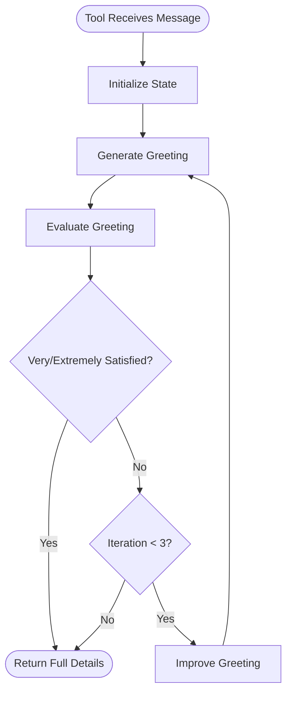

# LangGraph Workflow Agent

A hello-world agent demonstrating the evaluator-optimizer workflow pattern using LangGraph. This agent takes a simple greeting and iteratively improves it to be more friendly, engaging, and personalized.

**📚 Learn the patterns**: This agent demonstrates workflow tool patterns covered in [Lesson 22: Decision Framework](https://github.com/EmberAGI/arbitrum-vibekit/blob/main/typescript/lib/arbitrum-vibekit-core/docs/lesson-22.md) and single-skill architecture from [Lesson 19: Skills Foundation](https://github.com/EmberAGI/arbitrum-vibekit/blob/main/typescript/lib/arbitrum-vibekit-core/docs/lesson-19.md).

## Overview

The agent implements a classic AI pattern where:

1. **Generator** creates or improves content
2. **Evaluator** assesses quality using defined criteria
3. **Optimizer** plans improvements based on evaluation
4. The workflow iterates until satisfaction criteria are met

## Architecture

### Workflow Pattern



### Key Components

- **Single Skill**: `greeting-optimizer` - Optimizes greetings ([Lesson 19](https://github.com/EmberAGI/arbitrum-vibekit/blob/main/typescript/lib/arbitrum-vibekit-core/docs/lesson-19.md))
- **Single Tool**: `optimize-greeting` - Encapsulates the entire LangGraph workflow (workflow tool pattern from [Lesson 22](https://github.com/EmberAGI/arbitrum-vibekit/blob/main/typescript/lib/arbitrum-vibekit-core/docs/lesson-22.md))
- **Three Nodes**:
  - **Generator**: Creates/improves greetings based on feedback
  - **Evaluator**: Rates on friendliness, engagement, and personalization
  - **Optimizer**: Creates improvement strategies

### Satisfaction Scale

The workflow uses a 5-level satisfaction scale:

- **Not satisfied**: Major issues, needs complete rework
- **Somewhat satisfied**: Below expectations, needs significant improvement
- **Satisfied**: Acceptable but could be better
- **Very satisfied**: Good quality, meets expectations ✅ (terminates)
- **Extremely satisfied**: Excellent, exceeds expectations ✅ (terminates)

## Setup

### Prerequisites

- Node.js 18+
- At least one AI provider API key (OpenRouter, OpenAI, Grok/xAI, or Hyperbolic)

### Installation

```bash
# From the agent directory
pnpm install
```

### Configuration

1. Copy the environment template:

   ```bash
   cp env.example .env
   ```

2. Edit `.env` and add your API keys:

   ```env
   # Option 1: OpenRouter (supports many models)
   OPENROUTER_API_KEY=your-openrouter-api-key

   # Option 2: OpenAI
   OPENAI_API_KEY=your-openai-api-key

   # Option 3: Grok (xAI)
   XAI_API_KEY=your-xai-api-key

   # Option 4: Hyperbolic
   HYPERBOLIC_API_KEY=your-hyperbolic-api-key

   # Optional: Preferred provider (defaults to first configured)
   AI_PROVIDER=openrouter

   # Optional: Model override (defaults to provider-specific default)
   AI_MODEL=google/gemini-2.5-flash
   ```

See `env.example` for all available configuration options.

## Usage

### Starting the Agent

```bash
pnpm dev
```

### Example Requests

#### Basic Greeting Optimization

```bash
curl -X POST http://localhost:41241/invoke \
  -H "Content-Type: application/json" \
  -d '{
    "skillId": "greeting-optimizer",
    "input": {
      "message": "hello"
    }
  }'
```

**Example Evolution:**

- Iteration 1: "Hello." → "Not satisfied" (too basic)
- Iteration 2: "Hello there! How are you?" → "Somewhat satisfied" (generic)
- Iteration 3: "Hello there! 👋 It's great to hear from you. How can I help you today?" → "Very satisfied" ✅

#### Edge Cases

**Numbers as Greeting:**

```json
{
  "message": "12345"
}
```

Response acknowledges the unusual input humorously before optimizing.

**Very Long Input:**

```json
{
  "message": "hello hello hello hello hello hello hello hello hello hello hello hello"
}
```

Handles gracefully and creates a proper greeting.

**Empty String:**

```json
{
  "message": ""
}
```

Treats as a request for a general greeting.

### Response Format

The tool returns a Task with an artifact containing:

```json
{
  "originalGreeting": "hello",
  "optimizedGreeting": "Hello there! 👋 It's great to hear from you. How can I help you today?",
  "iterations": 3,
  "finalSatisfaction": "Very satisfied",
  "evaluationHistory": [
    {
      "iteration": 1,
      "satisfaction": "Not satisfied",
      "greeting": "Hello."
    }
    // ... more iterations
  ],
  "feedbackHistory": [
    ["Too basic, lacks warmth", "No engagement", "Not personalized"]
    // ... feedback for each iteration
  ],
  "evaluationCriteria": {
    "friendliness": "Very satisfied",
    "engagement": "Very satisfied",
    "personalization": "Very satisfied"
  }
}
```

## Development

### Project Structure

```
langgraph-workflow-agent/
├── src/
│   ├── index.ts              # MCP server setup
│   │   └── greeting-optimizer.ts
│   ├── tools/
│   │   └── optimize-greeting.ts
│   ├── workflow/
│   │   ├── index.ts          # Workflow factory
│   │   ├── state.ts          # State types and schema
│   │   ├── nodes/
│   │   │   ├── generator.ts
│   │   │   ├── evaluator.ts
│   │   │   └── optimizer.ts
│   │   └── prompts/
│   │       ├── generator.ts
│   │       ├── evaluator.ts
│   │       └── optimizer.ts
│   └── types.ts
├── test/
├── package.json
├── tsconfig.json
└── README.md
```

### Key Design Decisions

1. **Single Tool Pattern**: The entire workflow is encapsulated in one tool, making it easy to understand and use
2. **Satisfaction-Based Termination**: Uses human-understandable satisfaction levels rather than numeric scores
3. **Graceful Error Handling**: Returns best result so far if workflow fails
4. **Edge Case Humor**: Handles weird inputs with personality

### Testing

The project includes comprehensive tests at three levels:

1. **Unit Tests** - Test individual components with mocked LLM calls

   - State utilities
   - Generator node
   - Evaluator node
   - Optimizer node
   - Workflow orchestration

2. **Integration Tests** - Test with real OpenRouter API
   - Requires `OPENROUTER_API_KEY` environment variable
   - Tests skip automatically if no API key is provided
   - Uses `openai/gpt-4o-mini` model by default (cost-effective)

```bash
# Run all tests in watch mode
pnpm test

# Run unit tests only
pnpm test:unit

# Run integration tests (requires API key)
export OPENROUTER_API_KEY=your_key_here
pnpm test:integration

# Run all tests once (CI mode)
pnpm test:all
```

## How It Works

1. **User sends greeting**: e.g., "hello"
2. **Generator creates initial response**: "Hello."
3. **Evaluator rates it**:
   - Friendliness: "Not satisfied"
   - Engagement: "Not satisfied"
   - Personalization: "Not satisfied"
4. **Optimizer creates strategy**: "Add warmth, include emoji, ask question"
5. **Generator improves**: "Hello there! How are you?"
6. **Process repeats** until "Very satisfied" or 3 iterations

## Extending the Agent

### Adding New Evaluation Criteria

Edit `src/workflow/state.ts`:

```typescript
evaluationCriteria: {
  friendliness: SatisfactionLevel;
  engagement: SatisfactionLevel;
  personalization: SatisfactionLevel;
  // Add new criteria here
  professionalism: SatisfactionLevel;
}
```

### Changing Termination Conditions

Edit `src/workflow/state.ts`:

```typescript
export const ACCEPTABLE_LEVELS: SatisfactionLevel[] = [
  'Very satisfied',
  'Extremely satisfied',
  // Or change to just "Extremely satisfied" for higher standards
];
```

### Adjusting Iteration Limits

Edit `src/workflow/state.ts`:

```typescript
maxIterations: 5, // Instead of 3
```

## Troubleshooting

### "No model provider available"

- Ensure `OPENROUTER_API_KEY` is set in your `.env` file
- Check that the API key is valid

### Workflow doesn't improve greeting

- Check the evaluator prompts in `src/workflow/prompts/evaluator.ts`
- Verify the optimizer is creating actionable feedback

### Too many/few iterations

- Adjust `maxIterations` in the initial state
- Modify `ACCEPTABLE_LEVELS` to change termination criteria

## License

MIT
